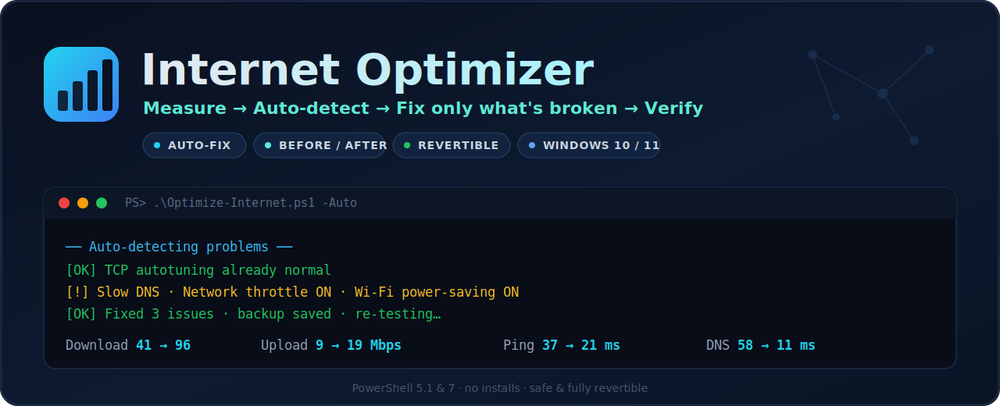

# Internet Optimizer (Windows)




A safe PowerShell script that **measures** your connection (download & upload
speed, ping, jitter, **bufferbloat**, packet loss, DNS time) and applies real,
proven speed/stability tweaks — then shows you the before/after. The download
test uses **4 parallel streams** so it reflects your real line speed (a single
stream undercounts fast connections).

> **Bufferbloat** is the standout metric: it measures how much your ping spikes
> while the link is busy. It's the #1 cause of lag in games/calls even on fast
> connections, and most speed tests never show it. You get a letter grade
> (A+ → F) like the well-known bufferbloat tests.

## ⚡ Recommended: Auto mode
`Auto` does it all in one shot — **reads your speed, finds only the things that
are actually wrong, fixes those, then re-tests to prove it helped.** It won't
touch anything that's already fine, and it backs up before every change.

```powershell
powershell -ExecutionPolicy Bypass -File .\Optimize-Internet.ps1 -Auto
```
(or just double-click `Run.bat` and pick **[1] AUTO**)

## How it works


> It can't make your internet faster than your ISP plan. What it does is remove
> the things that keep Windows *below* that ceiling: slow DNS, Windows' built-in
> network throttle, Wi‑Fi/NIC power-saving, and poor TCP settings.

## What it changes (only with `-Apply`)
1. **Fastest DNS** — tests Cloudflare / Google / Quad9 / OpenDNS / your current one, picks the fastest, sets it.
2. **Removes Windows' network throttle** (`NetworkThrottlingIndex`).
3. **TCP autotuning + RSS** so big downloads ramp to full speed.
4. **Stops the adapter power-saving** (a top cause of Wi‑Fi slow-downs and drops).
5. **High-performance power plan.**
6. **Optimal MTU** (only if it detects a clearly better value).
7. **(optional) `-Gaming`** — lowers latency by disabling Nagle's algorithm.

Everything it touches is **backed up first** to `net-backup-*.json`, and you can
undo it all with one command.

## Easiest way: double-click `Run.bat`

1. Copy **both** `Run.bat` and `Optimize-Internet.ps1` into the **same folder** on your Windows PC.
2. **Double-click `Run.bat`.** Click **Yes** on the Administrator prompt.
3. Pick from the menu:
   ```
     [1]  AUTO  (recommended)   read -> find problems -> fix only those -> re-test
     [2]  Measure only          (changes nothing)
     [3]  Optimize ALL          (apply every tweak)
     [4]  Optimize ALL + Gaming
     [5]  Undo / Revert
     [6]  Exit
   ```
That's it — no typing commands. (The manual command-line way is below if you prefer it.)

---

## Manual way (PowerShell)

1. Copy `Optimize-Internet.ps1` to your **Windows PC** (USB, download, OneDrive — anything).
2. Right‑click the **Start button → "Terminal (Admin)"** or **"Windows PowerShell (Admin)"**.
3. `cd` to the folder, e.g.:
   ```powershell
   cd C:\Users\YOU\Downloads
   ```
4. **First, just measure (changes nothing):**
   ```powershell
   powershell -ExecutionPolicy Bypass -File .\Optimize-Internet.ps1
   ```
5. **Apply the optimizations:**
   ```powershell
   powershell -ExecutionPolicy Bypass -File .\Optimize-Internet.ps1 -Apply
   ```
   (add `-Gaming` on the end if you want lower latency for games/voice)

6. **Undo everything, anytime:**
   ```powershell
   powershell -ExecutionPolicy Bypass -File .\Optimize-Internet.ps1 -Revert
   ```

> The script auto-elevates to Administrator (you'll see a UAC prompt — click Yes).
> The `-ExecutionPolicy Bypass` part is just so Windows lets the script run; it
> doesn't change any system policy permanently.

## After applying
A **reboot** helps the TCP/MTU changes fully take effect. If anything ever feels
worse, run `-Revert` and reboot — you're back to exactly how you started.

## Stability watchdog (stop drops)
If your connection randomly drops, run the watchdog. It pings continuously and:
- **logs every drop** to a timestamped CSV (`net-watchdog-*.csv`) with the outage
  duration — proof you can send your ISP ("it dropped 14× yesterday, 6 min total"),
- prints a live heartbeat (uptime %, outage count),
- on a **sustained** outage (with `-AutoReset`) **auto-resets the adapter** to recover,
- prints an **uptime summary** when you stop it (Ctrl+C).

```powershell
# monitor + log only:
powershell -ExecutionPolicy Bypass -File .\Optimize-Internet.ps1 -Watch
# also auto-reset the adapter during a long outage:
powershell -ExecutionPolicy Bypass -File .\Optimize-Internet.ps1 -Watch -AutoReset
```
(or `Run.bat` → **[5]** monitor, or **[6]** monitor + auto-reset)

## Requirements
- **Windows 10 or 11** (also works on Win8.1 / Server with the networking cmdlets).
- **Windows PowerShell 5.1** (built into Windows) **or PowerShell 7+** — both supported.
- Run as **Administrator** (the launcher does this for you).

The script preflight-checks all of this and exits cleanly with a clear message
if something's missing — it won't half-run or crash.

## Is it safe?
- Measure-only by default; **nothing changes** unless you pass `-Apply`.
- Every changed setting is saved to a backup file before the change.
- `-Revert` restores that backup.
- No third-party downloads, no "boosters", no registry voodoo — only documented
  Windows networking settings.
