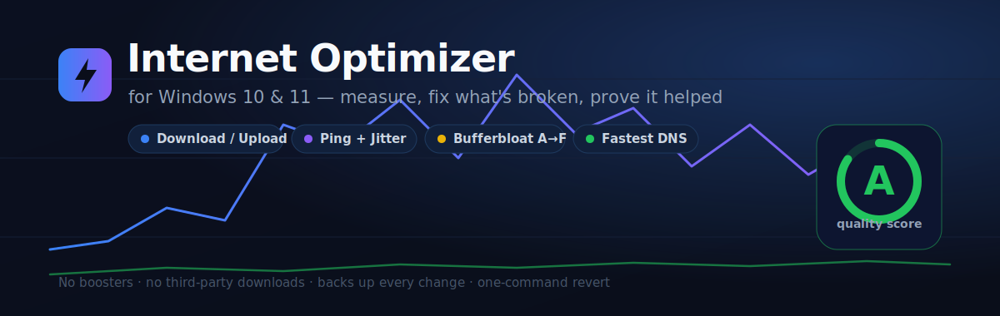
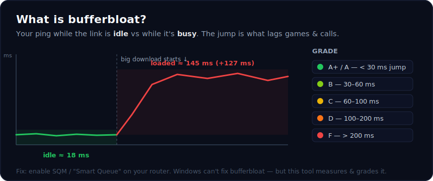
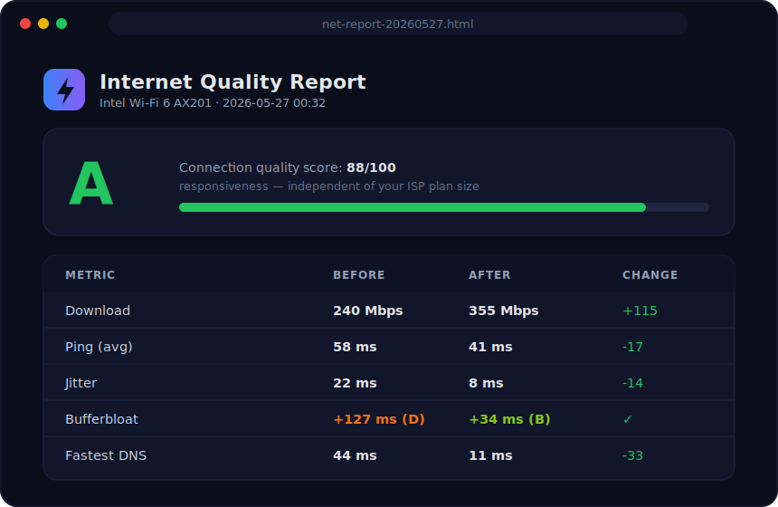

<div align="center">



# Internet Optimizer for Windows

**Measure your connection → fix only what's actually broken → prove it helped.**
No boosters, no snake-oil, no third-party downloads — just documented Windows networking settings, every change backed up and reversible.


</div>

---

## ⚡ Quick start

```powershell
# Recommended — reads your speed, fixes only what's wrong, re-tests to prove it:
powershell -ExecutionPolicy Bypass -File .\Optimize-Internet.ps1 -Auto

# Add a shareable HTML report (great for sending your ISP):
powershell -ExecutionPolicy Bypass -File .\Optimize-Internet.ps1 -Auto -Report
```

> **Even easier:** copy `Run.bat` + `Optimize-Internet.ps1` into one folder, **double-click `Run.bat`**, and pick **[1] AUTO**. No typing.

---

## 📊 What it measures

| Metric | Why it matters |
| --- | --- |
| **Download / Upload** | Real line speed — uses **4 parallel streams** (a single stream undercounts fast connections). |
| **Ping + Jitter** | Latency *and* its stability. High jitter is what makes calls/games stutter even when the average looks fine. |
| **Bufferbloat** ⭐ | How much your ping spikes **under load** — graded **A+ → F**. The #1 cause of lag on otherwise-fast lines, and most speed tests never show it. |
| **Packet loss** | Dropped packets — usually Wi‑Fi signal or ISP. |
| **DNS time** | Tests Cloudflare / Google / Quad9 / OpenDNS / your current one and picks the fastest. |
| **Quality score** | One objective **A+ → F** grade for responsiveness, independent of how big an ISP plan you pay for. |

### Bufferbloat — the headline metric



### Shareable HTML report (`-Report`)



---

## 🔧 What it changes (only with `-Auto` or `-Apply`)

1. **Fastest DNS** — tests the major resolvers + your current one, sets the quickest.
2. **Removes Windows' network throttle** (`NetworkThrottlingIndex`).
3. **TCP autotuning + RSS** so big downloads ramp to full speed.
4. **Stops adapter power-saving** (a top cause of Wi‑Fi slow-downs and drops).
5. **High-performance power plan.**
6. **Optimal MTU** (only if it detects a clearly better value).
7. **(optional) `-Gaming`** — lowers latency by disabling Nagle's algorithm.

`-Auto` is the smart mode: it reads your current settings and **changes only the things that are actually wrong**, leaving anything already-fine untouched. Everything it touches is **backed up first** to `net-backup-*.json`, undoable with one command.

> It can't make your internet faster than your ISP plan. What it *does* is remove
> the things that keep Windows **below** that ceiling: slow DNS, the built-in
> network throttle, Wi‑Fi/NIC power-saving, and poor TCP settings.


---

## 🖥️ How to run

### Easiest — double-click `Run.bat`
```
  [1]  AUTO  (recommended)   read -> find problems -> fix only those -> re-test
  [2]  Measure only          (changes nothing)
  [3]  Optimize ALL          (apply every tweak)
  [4]  Optimize ALL + Gaming
  [5]  Undo / Revert
  [6]  Exit
```

### Manual (PowerShell, as Administrator)
```powershell
.\Optimize-Internet.ps1                 # measure only — changes nothing
.\Optimize-Internet.ps1 -Auto           # fix only what's broken, then re-test
.\Optimize-Internet.ps1 -Apply -Gaming  # apply everything + low-latency tweak
.\Optimize-Internet.ps1 -Revert         # undo, restore the last backup
```
Add **`-Report`** to any run to also drop a styled `net-report-*.html` next to the script and open it.

> The script auto-elevates to Administrator (you'll see a UAC prompt — click **Yes**).
> `-ExecutionPolicy Bypass` just lets the script run this once; it changes no system policy.

---

## 📡 Stability watchdog — stop random drops

If your connection randomly drops, run the watchdog. It pings continuously and:
- **logs every drop** to a timestamped CSV (`net-watchdog-*.csv`) with outage duration — proof for your ISP ("it dropped 14× yesterday, 6 min total"),
- prints a live heartbeat (uptime %, outage count),
- on a **sustained** outage (with `-AutoReset`) **auto-resets the adapter** to recover,
- prints an **uptime summary** when you stop it (Ctrl+C).

```powershell
.\Optimize-Internet.ps1 -Watch              # monitor + log
.\Optimize-Internet.ps1 -Watch -AutoReset   # also auto-reset during a long outage
```

---

## ✅ Is it safe?

- **Measure-only by default** — nothing changes unless you pass `-Auto`/`-Apply`.
- Every changed setting is saved to a backup file **before** the change.
- `-Revert` restores that backup; a reboot helps TCP/MTU changes fully settle.
- No third-party downloads, no "boosters", no registry voodoo — only documented Windows networking settings.

## Requirements
- **Windows 10 or 11** (also works on Win8.1 / Server with the networking cmdlets).
- **Windows PowerShell 5.1** (built in) **or PowerShell 7+** — both supported.
- Run as **Administrator** (the launcher does this for you).

The script preflight-checks all of this and exits cleanly with a clear message if something's missing — it won't half-run or crash.

---

<div align="center">
<sub>MIT licensed · measure → backup → revert · no boosters, ever</sub>
</div>
